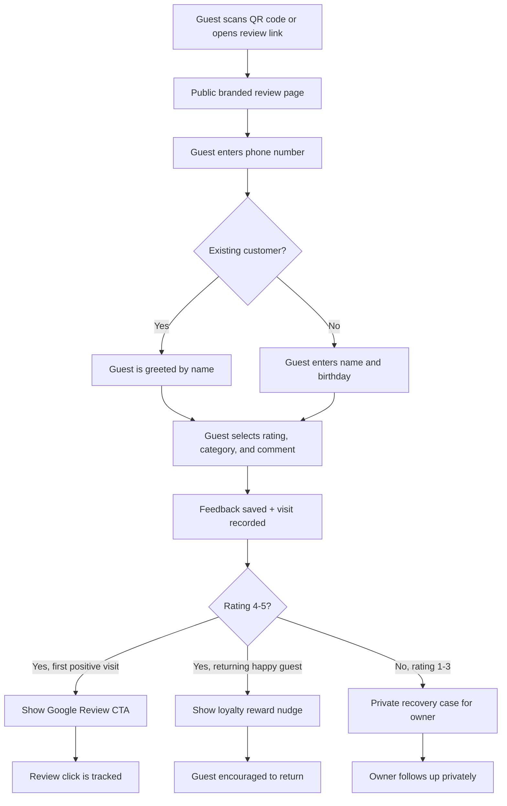
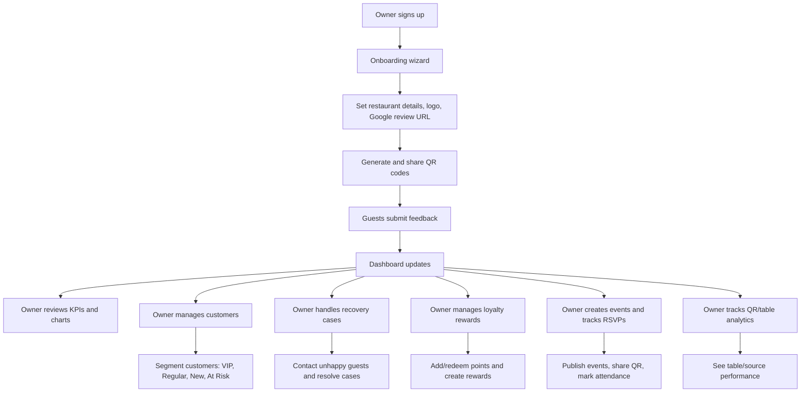

# PatronFlow Product Overview

PatronFlow is a restaurant feedback, reputation, customer retention, loyalty, and event engagement platform. It helps restaurant owners collect private feedback, increase positive Google reviews, recover unhappy guests, track customer behavior, and bring guests back through loyalty and events.

---

## Core Value Proposition

- Convert happy guests into public Google reviews.
- Keep unhappy guest feedback private and actionable.
- Build a customer database automatically from QR feedback.
- Track repeat visits, customer segments, loyalty points, birthdays, and event RSVPs.
- Give restaurant owners a clean dashboard to manage reputation, retention, and guest recovery.

---

## Customer / Guest Flow

### What the Guest Experiences

- Scans a QR code from a table, poster, event, or direct link.
- Enters phone number first, making the process quick for returning guests.
- First-time guests enter name and birthday.
- Returning guests are recognized automatically.
- Leaves a star rating, feedback category, and optional comment.
- Happy first-time positive guests are sent to Google review.
- Returning happy guests are shown a loyalty nudge instead of being asked to review again.
- Unhappy guests are thanked privately and routed to the owner for recovery.
- Event guests can RSVP from a public event page.

### Customer-Side Advantages

- No app installation needed.
- Fast and mobile-friendly.
- Returning guests do not repeat unnecessary details.
- Complaints go privately to the restaurant instead of public platforms.
- Loyal customers are encouraged with rewards.
- Birthday information enables future special offers.

---

## Restaurant Owner Flow

---

## What the Owner Can Do

### 1. Onboarding

- Create an account.
- Enter restaurant name, cuisine type, logo, and Google review URL.
- Generate the first review QR code.
- Start collecting guest feedback immediately.

### 2. Dashboard

- View average rating.
- View total feedback count.
- View total customer count.
- Track positive feedback percentage.
- Track Google review conversion.
- See repeat customer metrics:
  - Repeat customers
  - Repeat rate
  - Average visits per customer
- View feedback trend chart.
- View rating distribution chart.
- View review funnel:
  - Feedback submitted
  - Positive feedback
  - Google review clicks
  - Conversion percentage
- See restaurant insights:
  - Most common complaint
  - Top positive topic
  - Highest rated category
  - Lowest rated category
  - Weekly feedback comparison
  - Monthly feedback comparison
- See recovery widget and upcoming events widget.
- View recent feedback.

### 3. Customers

- View all customer profiles.
- Search customers by name, phone, or email.
- Filter customers by segment.
- View customer details in a drawer.
- See each customer's:
  - Name
  - Phone
  - Email
  - Birthday
  - Visit count
  - Average rating
  - Segment
  - Last visit
  - Feedback timeline
  - Loyalty summary
- Auto-segment customers:
  - VIP: 5+ visits
  - Regular: 2-4 visits
  - New: 1 visit
  - At Risk: no activity for 60+ days
- Delete one customer.
- Select multiple customers and bulk delete them.
- Export customers.

### 4. Feedback

- View all submitted feedback.
- See star rating, category, comment, customer, source, and table information.
- Track whether guests clicked through to Google review.
- Export feedback.

### 5. Recovery

- View all negative feedback cases.
- Track recovery statuses:
  - Pending
  - Contacted
  - Resolved
- Add internal recovery notes.
- Read full negative feedback comments.
- Track recovery analytics:
  - Total negative feedback
  - Recovered customers
  - Recovery rate
  - Open cases

### 6. Loyalty

- Create loyalty rewards.
- Delete loyalty rewards.
- View loyalty members and point balances.
- Add points to a customer.
- Redeem points from a customer.
- Adjust points manually.
- Add transaction notes.
- View full points history.
- Encourage returning happy guests with loyalty nudges.

### 7. Events

- Create events.
- Edit events.
- Delete events.
- Upload event cover images.
- Manage event status:
  - Draft
  - Published
  - Completed
- Generate event QR codes.
- Open public event pages.
- Collect RSVPs.
- View RSVPs.
- Mark guests as attended.
- Track event analytics:
  - Total RSVPs
  - Attended guests
  - Conversion rate
  - RSVP growth

### 8. QR Codes

- Create general review QR codes.
- Create table-specific QR codes.
- Download and print QR codes.
- Track table-level analytics:
  - Feedback count
  - Review clicks
  - Average rating per table
- Understand which tables, sections, or sources perform best.

### 9. Settings

- Update restaurant details.
- Update restaurant logo.
- Update Google review URL.
- Change dashboard theme:
  - Light
  - Dark
  - System

### 10. Notifications

- Receive alerts for:
  - Negative feedback
  - New customers
  - VIP customers
  - Customer birthdays

---

## Business Advantages for Restaurant Owners

- Improves Google rating by routing happy guests to public reviews.
- Protects public reputation by keeping negative feedback private.
- Helps recover unhappy customers before they are lost.
- Builds a reusable customer database.
- Identifies VIPs, regulars, new guests, and at-risk guests automatically.
- Encourages repeat visits through loyalty rewards.
- Captures birthdays for future offers and personalization.
- Tracks table/source performance with QR analytics.
- Measures event attendance and RSVP performance.
- Gives owners actionable insights instead of raw feedback only.
- Keeps public pages simple and light, while the dashboard supports light/dark/system themes after sign-in.

---

## Summary

PatronFlow is not just a review form. It is a full restaurant growth system:

- **Reputation:** grow Google reviews from happy guests.
- **Recovery:** privately fix negative experiences.
- **Retention:** identify and bring back customers.
- **Loyalty:** reward repeat visitors.
- **Events:** collect RSVPs and track attendance.
- **Analytics:** understand what is working and what needs attention.

